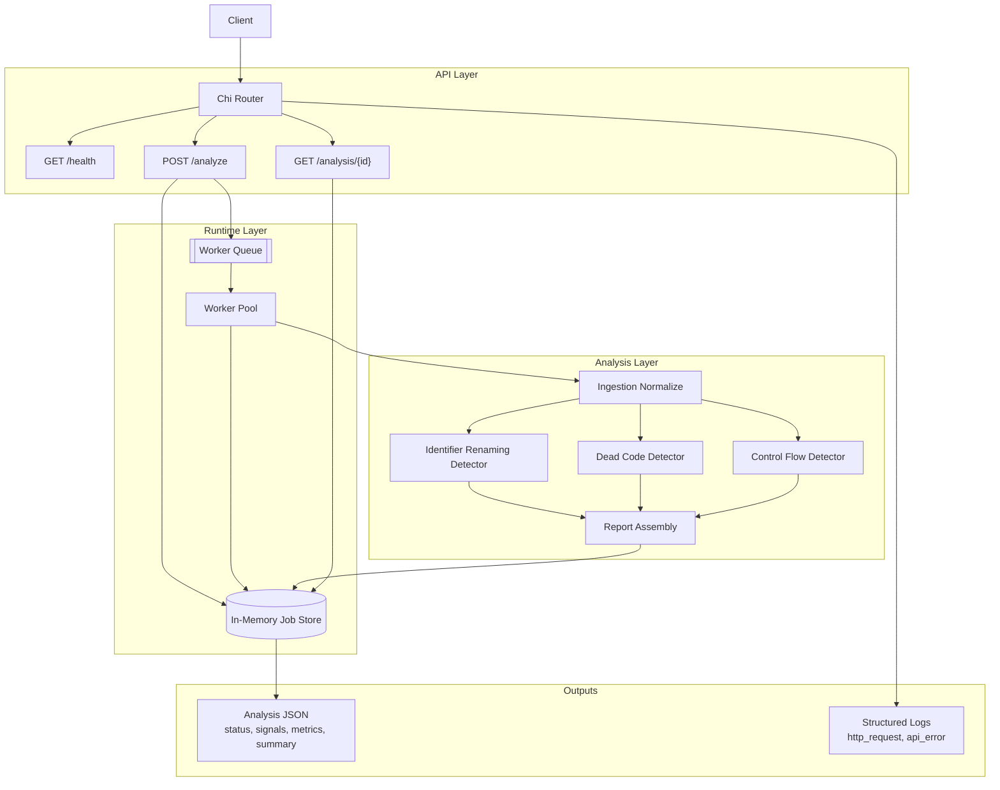

# GraphSentinel

**Structural code intelligence for detecting semantics-preserving transformations.**

GraphSentinel is a Go backend service for analyzing source code structure and detecting semantics-preserving transformations relevant to GNN robustness and code security research.

> **Portfolio positioning:** production-style Go backend, async job processing, modular detectors, security-focused code analysis, thesis-aligned graph intelligence pipeline.

## Why this project exists

Vulnerability detectors built on graph neural networks (GNNs) can look strong on clean code yet behave unpredictably under **semantics-preserving obfuscation** (renaming, dead branches, control-flow reshaping). GraphSentinel is a small but serious service that turns that problem into an **API-first workflow**: submit code, process asynchronously, emit **machine-readable** signals and scores you can later plug into evaluation harnesses, datasets, and graph-based ML pipelines.

## Thesis connection

This repository supports work on **evaluating robustness of GNN-based vulnerability detection under obfuscation**. The MVP ships **text and token heuristics** (not a full industrial parser) so the system stays shippable and testable while the architecture stays ready for AST, CFG, and graph-drift layers. The goal is a credible backend you can discuss in interviews and extend in research without rewriting the platform from scratch.

## Features

- **HTTP API** with JSON request and response bodies (`chi` router).
- **Async jobs** with an in-memory store and a fixed **worker pool** (queue depth configurable).
- **MVP detectors** (heuristic, modular): identifier renaming, dead code, control-flow drift. Each exposes a **boolean signal** and a **numeric score** mapped into the public report.
- **Structured logging** (`log/slog`, JSON to stdout) and consistent **error envelopes** with stable `code` values.
- **Docker** image with non-root user and a basic health check.
- **Makefile** targets for local iteration (`run`, `test`, `check`).

## Architecture

GraphSentinel follows a layered execution path: thin HTTP handlers, a store abstraction, workers that claim jobs, and an analyzer pipeline that materializes a machine-readable report.



**Request path (submit):** `POST /analyze` validates the payload, persists a `queued` job, returns `202 Accepted` with an `analysis_id`, and schedules background processing.

**Request path (poll):** `GET /analysis/{id}` returns the latest job snapshot: `queued`, `running`, `completed` (with signals, metrics, summary), or `failed` (with an error string).

## API

| Method | Path | Description |
|--------|------|-------------|
| `GET` | `/health` | Liveness: JSON `status` and `service` name. |
| `POST` | `/analyze` | Submit `language` and `code`. Returns `202` with `analysis_id`. |
| `GET` | `/analysis/{id}` | Poll job status and completed report fields. |

**Submit body**

```json
{
  "language": "c",
  "code": "int main(){return 0;}"
}
```

**Immediate response (`202 Accepted`)**

```json
{
  "status": "queued",
  "analysis_id": "<hex-id>"
}
```

**Completed analysis (`200 OK`, shape from `GetAnalysisResponse`)**

Fields include `analysis_id`, `status`, `language`, `signals` (`identifier_renaming`, `dead_code`, `control_flow_change`), `metrics` (aligned score names), and `summary`. Failed jobs return the same envelope with `status: failed` and `error` populated.

**Errors**

JSON error body: `{ "error": "<message>", "code": "<STABLE_CODE>" }`. See `pkg/models/responses.go` for `ErrCode*` constants.

## Quickstart

```bash
make run
```

Full validation (format, vet, tests):

```bash
make check
```

### Environment

| Variable | Default | Description |
|----------|---------|-------------|
| `HTTP_ADDR` | `:8080` | Listen address (`host:port` or `:port`) |
| `LOG_LEVEL` | `info` | `debug`, `info`, `warn`, or `error` |
| `SHUTDOWN_TIMEOUT_SEC` | `15` | Graceful shutdown timeout |
| `WORKER_COUNT` | `2` | Worker goroutines |
| `WORKER_QUEUE_SIZE` | `256` | Buffered queue for job ids |
| `READ_TIMEOUT_SEC` | `30` | Server read timeout |
| `WRITE_TIMEOUT_SEC` | `60` | Server write timeout |
| `IDLE_TIMEOUT_SEC` | `120` | Idle timeout |

Structured logs: JSON lines on stdout. Typical messages include `http_request` (one line per HTTP request) and `api_error` (client or server errors).

Copy `configs/.env.example` into your environment or orchestrator.

### Example curl

Health:

```bash
curl -s http://127.0.0.1:8080/health
```

Submit:

```bash
curl -s -i -X POST http://127.0.0.1:8080/analyze \
  -H 'Content-Type: application/json' \
  -d '{"language":"c","code":"int main(){return 0;}"}'
```

Poll (replace the id):

```bash
curl -s http://127.0.0.1:8080/analysis/<hex-id>
```

Validation error:

```bash
curl -s -X POST http://127.0.0.1:8080/analyze \
  -H 'Content-Type: application/json' \
  -d '{"language":"c","code":""}'
```

Example body:

```json
{"error":"code is required","code":"VALIDATION_ERROR"}
```

### Docker

```bash
docker build -t graphsentinel:dev .
docker run --rm -p 8080:8080 graphsentinel:dev
```

## Repository layout

- `cmd/server` : application entrypoint
- `internal/api` : HTTP routing and handlers
- `internal/config` : environment-based configuration
- `internal/store` : job persistence (`Memory` implementation)
- `internal/workers` : worker pool and job execution
- `internal/ingestion` : shared text normalization for detectors
- `internal/detectors` : MVP heuristics (replaceable with graph-backed implementations)
- `internal/analyzers` : orchestration and summary generation
- `internal/reports` : helpers for report building (stub retained for experiments)
- `pkg/models` : API and domain types shared across packages
- `configs/`, `scripts/`, `deployments/`, `testdata/` : configuration, tooling, and fixtures

## Roadmap

| Phase | Focus | Outcome |
|-------|--------|---------|
| Done | Foundation, HTTP, models, async jobs, three MVP detectors | Runnable service with structured reports |
| Next | Parser-backed AST for select languages | Richer structural features than text heuristics |
| Next | CFG extraction and graph serialization | Closer alignment with GGNN-style inputs |
| Next | Drift and compare mode (original vs obfuscated) | Direct robustness evaluation workflows |
| Next | Durable queues and storage (for example PostgreSQL, Redis) | Multi-instance deployments |

## Current status

The service is **end-to-end functional** for submit, queue, process, and poll. Detectors are **heuristic** and intentionally conservative about pretending to be a full static analyzer. Logs and API errors are shaped for **production-style** operations in a single binary with no external dependencies at runtime.

## Future extensions

- **AST parsing** per language front end, feeding typed identifier and control-flow facts into detectors.
- **CFG and PDG-style** intermediates for precise reachability and dead-code reasoning.
- **Graph drift scoring** between two submissions (baseline vs obfuscated).
- **Artifact ingestion** for thesis pipelines (for example precomputed graph tensors).
- **OpenTelemetry** export alongside structured logs.
- **Authn and rate limits** for any public deployment.

## License

Licensed under the [Apache License, Version 2.0](LICENSE).
